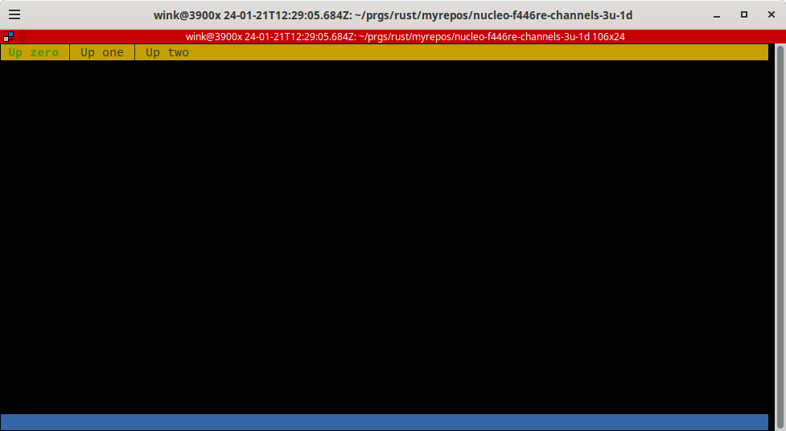
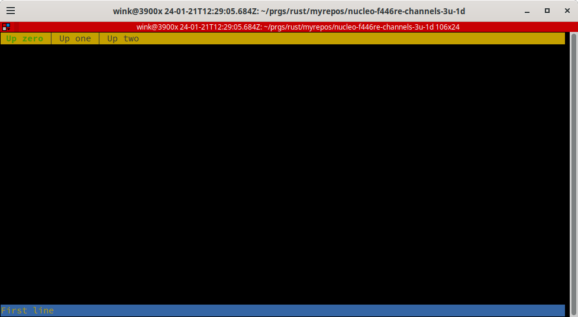
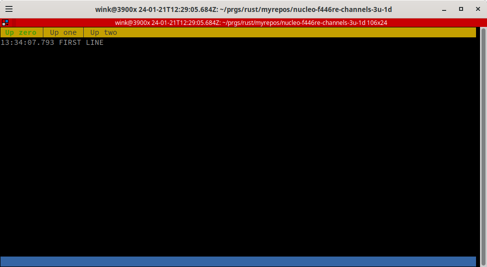
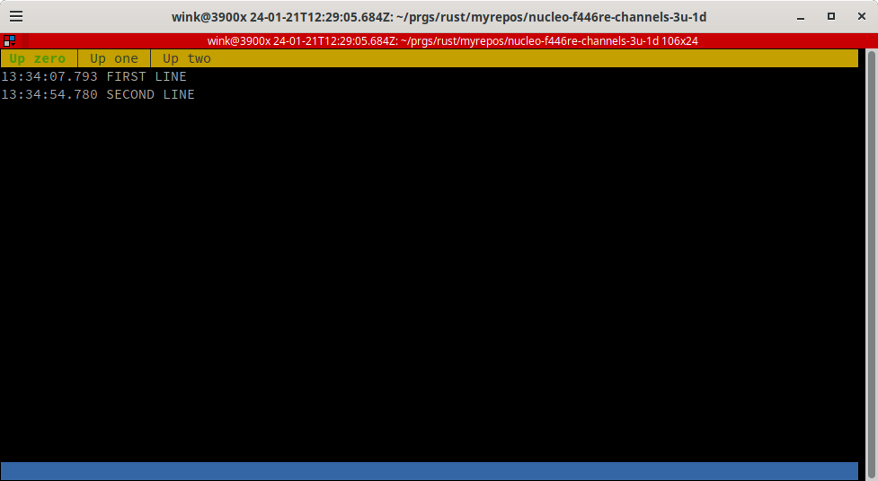
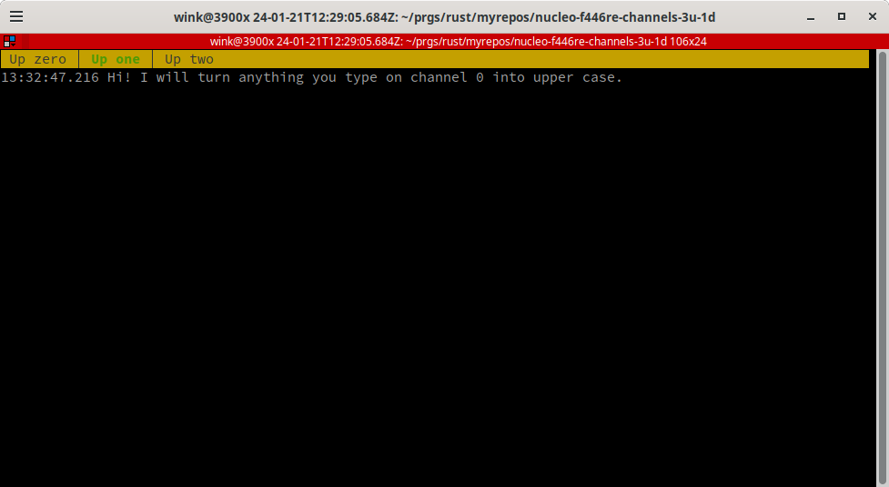

# nucleo-f446re-channels-3u-1d

This is basically [all-the-channels](https://probe.rs/docs/tools/cargo-embed/#all-the-channels!)
from probe-rs docs. I've tweaked it slightly adding delay. Note initially the
fn keys couldn't switch between the tabs. That was resolved by changing the
Terminator preferences so F1 and F11 were defined as Ctrl-F1 and Ctrl-F11 now
they don't interfere with `cargo-embed` use of fn keys. A longer term solution
is to be able to define the key bindings in the `cargo-embed` config file.

# Pre-requisites

See `probe-rs`
[install instructions](https://probe.rs/docs/getting-started/installation/) for your platform. For my Arch Linux platform it required only `libftdi` other
packages were already installed, so YMMV :)

# Build and run using cargo-embed

Run `cargo embed with_rtt` or `cargo embed` to build and flash
the program to the target and the result should be the initial
blank screen with 3 tabs:

I then type "First line" but don't hit enter, so in the "blue" input line
at the bottom of the screen you see "First line":

I then hit return and in "Up zero" we see "First line":

Next I type "Second line" and hit return in the "blue" input line, so in the "Up zero" we now
see the First and Second line:

If you click on the F2 (function key, on my keyboard I press Ctrl-F2) the tab will switch to "Up one":

## License

Licensed under either of

- Apache License, Version 2.0 ([LICENSE-APACHE](LICENSE-APACHE) or http://apache.org/licenses/LICENSE-2.0)
- MIT license ([LICENSE-MIT](LICENSE-MIT) or http://opensource.org/licenses/MIT)

### Contribution

Unless you explicitly state otherwise, any contribution intentionally submitted
for inclusion in the work by you, as defined in the Apache-2.0 license, shall
be dual licensed as above, without any additional terms or conditions.
